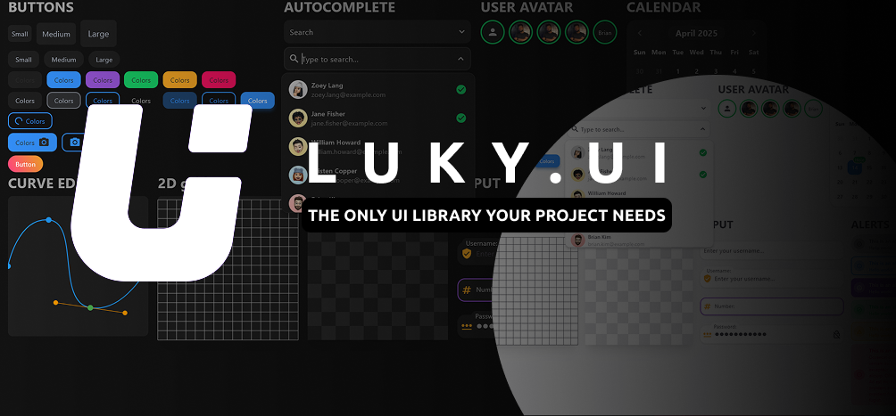

# Luky UI

A UI library that implements the most unique, customizable and feature reach components for flutter.

The goal of this ui kit is to be the shadcn ui of flutter with beautifull, fast and modern components that every app needs.

## Features

The current implementation contains the following features:
### Components:
- Buttons
- Autocomplete / dropdown
- User avatar with 3 ring levels
- Calendar
- Bezier Curve editor
- 2D grid (fully custimizable and support zoom in and out)
- Checker Background
- Input
- Alerts
- Accordion
- Checkbox
- Card
- Badge
- Ship
- Flow Diagram editor

### State management
Luky UI uses flutter streams and statefull widgets to manage states.
You have access to the `LukyEventSystem` to create event/streams and use them to listen to specifc events and emit custom events.

### Custom Themes
With Luky UI, you can change between multiple themes instead of just dark and light modes.

## Utility
Luky UI exposes some utility functions to help you supercharge your app.
Some of them are:
- Predefined sizes following the tailwind css convention
- Predefined Shadow values following the tailwind css implementation
- `LukyCenterSnapListView` A list view that snaps to the most centered child (used in the calendar component)
- `LukyCenteredDetector` A component that checks if it's on the midle of its parent (used in the calendar component)
- Scroll propagation prevention

The a lot more features that you can discover by reading the docs.

## Getting started
1 - Install the package

`flutter pub get luky`

2 - Wrap the part of the app that you want to use Luky UI with Luky().
Optionally, you can provide an initial theme.

```dart
Luky(
    initialTheme: lightTheme,
    child: MaterialApp(
    home: YourAppPage(),
    ),
)
```

## Creating a theme
You can create a new theme by instatiating `LukyThemeData` class and providing your custom colors, or leave blank to use the default one.

```dart
import 'package:flutter/material.dart';
import 'package:lukyui/lukyui_components.dart';

final lightTheme = LukyThemeData();
final darkTheme = LukyThemeData(
  colorScheme: LukyColorScheme(
    background: const Color(0xFF121212),
    surface: const Color(0xFF1E1E1E),
    onPrimary: const Color(0xFF2A2A2A),
    onBackground: const Color.fromARGB(255, 119, 119, 119),
    onSurface: const Color.fromARGB(255, 160, 160, 160),
    dividerColor: const Color(0xFF2B2B2B),
    defaultBackground: const Color(0xFF1E1E1E),
    defaultForeground: const Color(0xFF9ca3af),
  ),
);
```

## Using the theme values
You can get the current instance of the theme by gettingt it from the context;

Example:
```dart
final theme = Luky.of(context).theme;

Text(
    "Simple theme test",
    style: TextStyle(
        fontSize: theme.fontSize.text3Xl,
        fontWeight: FontWeight.bold,
        color: theme.colorScheme.onSurface,
    ),
),
```

## Aditional Notes
>This project is under development. Some additional component will be added and the current ones will be updated.
> 
>The documentation will be available soon...